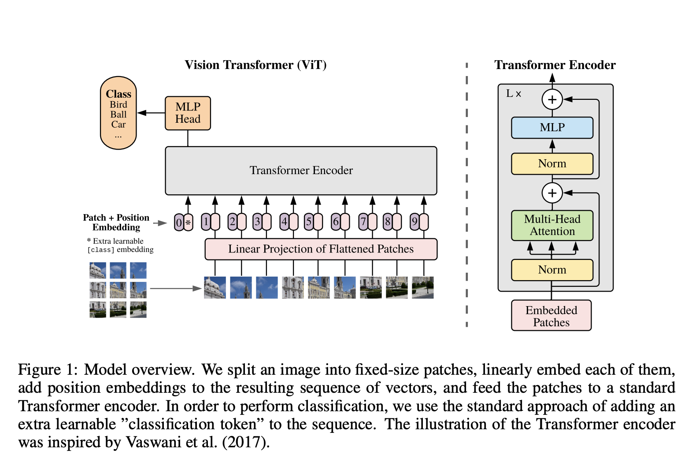

# Vision Transformer

Unofficial Tensorflow 2.x implementation of the Transformer based Image Classification model proposed by the paper [AN IMAGE IS WORTH 16X16 WORDS:
TRANSFORMERS FOR IMAGE RECOGNITION AT SCALE](https://openreview.net/pdf?id=YicbFdNTTy). The paper is currently under double-blind review.

GELU implementation has been taken from the latest master branch of [EchoAI](https://github.com/digantamisra98/Echo/).
